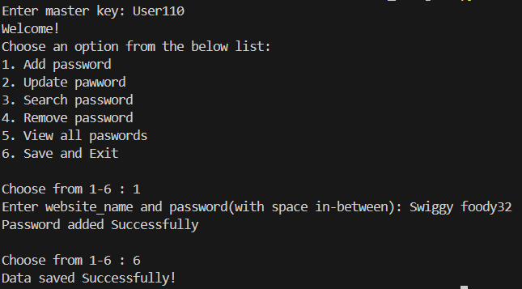

# project-MOS-Fluid_Dynamics


# Password Management System

A simple, console-based password manager made using Python. This mini-project uses object-oriented programming, and file handling in Python. It securely stores, retrieves, updates, and deletes passwords for various websites using a master key for authentication.

---

## Features

- **Master Key Authentication**
- **Stores Passwords in JSON File**
- **Add New Passwords**
- **Update Existing Passwords**
- **Search Passwords by Website**
- **Remove Stored Passwords**
- **View All Stored Passwords**
- **Auto Save on Exit**

---

## Master Key Security

- The master key is hardcoded and kept private using Python's double underscore convention (__masterkey).
- It can be made more robust with the encryption-decryption technique, using 'Fernet' module.

---

## Data Handling

- Passwords are stored in a password.json file located in the C:\Users\Public\Downloads\ directory.

- All website names are stored in lowercase to avoid case-sensitivity issues.

- Data is saved automatically on exit.

- If the file is missing or empty, a new one is created automatically.

---

## Setup Instructions

1. **Clone the Repository**

```bash
git clone https://github.com/vatsal770/Mini_Projects.git
cd Password_Management_System
```
2. **Run the Application**
```bash
python main.py
```
3. **Enter MasterKey**

- The default master key is: User110

4. **Choose one action from the Options**

- 1. Add password  
- 2. Update password  
- 3. Search password  
- 4. Remove password  
- 5. View all passwords  
- 6. Save and Exit  

---

## Sample Interaction Page:



---


---
